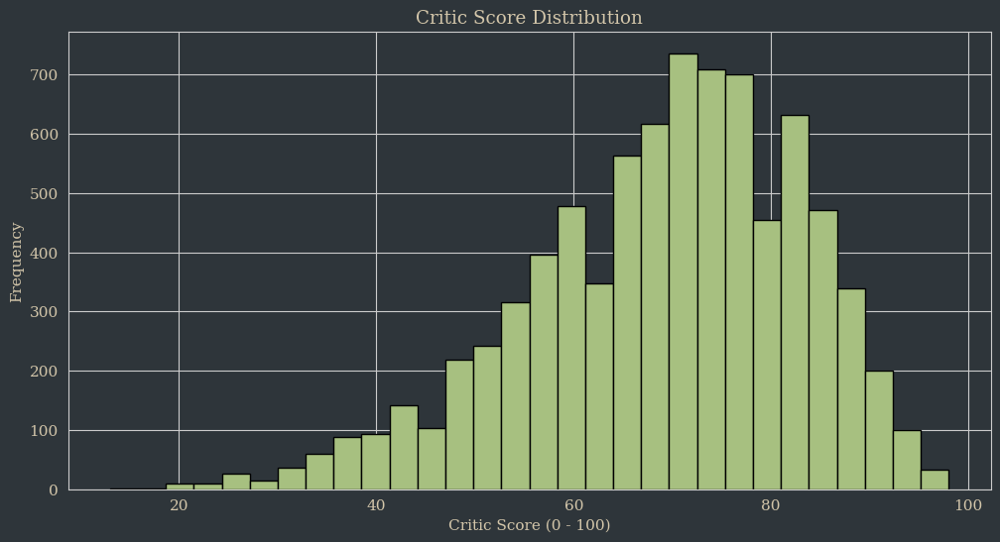
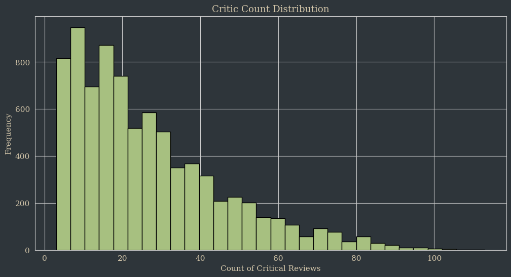
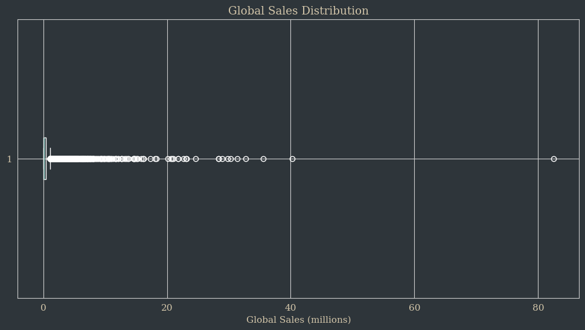
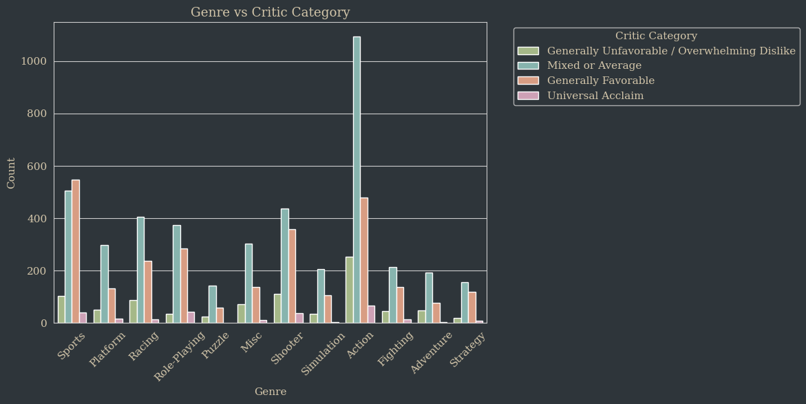
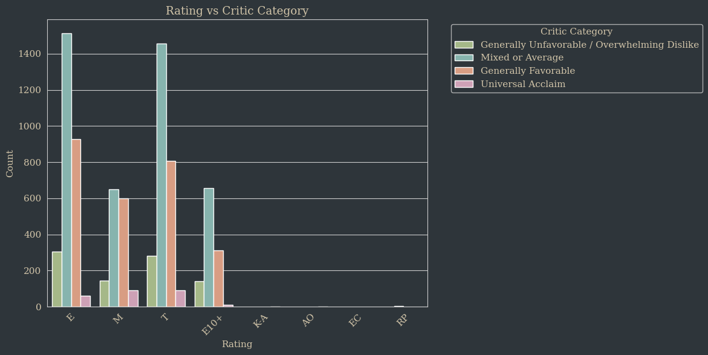
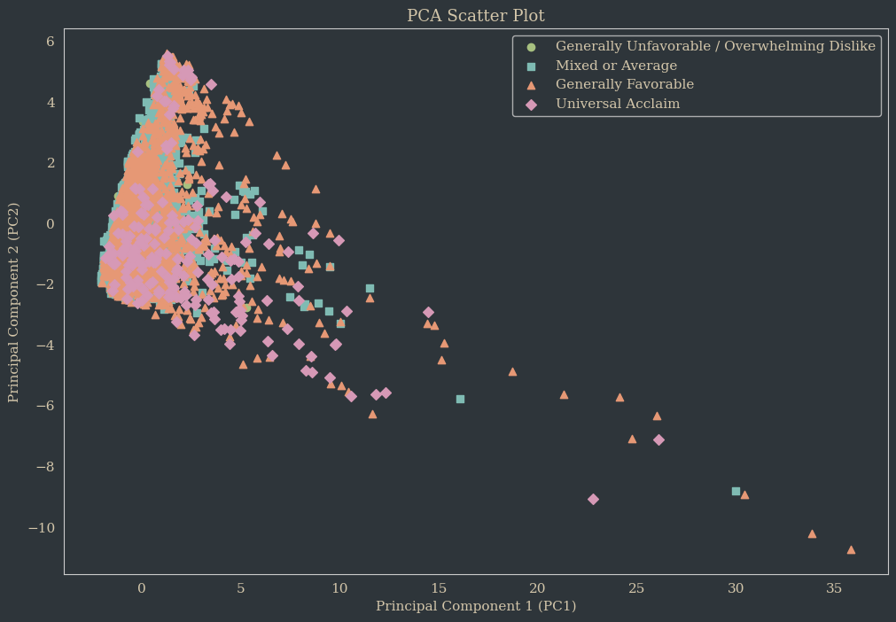

# DS 7331 - Lab 1 (Video Game Sales with Ratings Dataset Analysis)

## Eric Graham

# Dataset Information

This project uses the [Video Games Sales with Ratings](https://www.kaggle.com/datasets/rush4ratio/video-game-sales-with-ratings) dataset from Kaggle. It includes 16719 observations and 18 features.

## Variable Glossary

| Variable | Type | Description |
|----------|------|-------------|
| Name | object | Name of the game |
| Platform | object | Console on which the game is running |
| Year_of_Release | float64 | Year of the game released |
| Genre | object | Game's category |
| Publisher | object | Publisher |
| NA_Sales | float64 | Game sales in North America (in millions of units) |
| EU_Sales | float64 | Game sales in the European Union (in millions of units) |
| JP_Sales | float64 | Game sales in Japan (in millions of units) |
| Other_Sales | float64 | Game sales in the rest of the world, i.e. Africa, Asia excluding Japan, Australia, Europe excluding the E.U. and South America (in millions of units) |
| Global_Sales | float64 | Total sales in the world (in millions of units) |
| Critic_Score | float64 | Aggregate score compiled by Metacritic staff |
| Critic_Count | float64 | The number of critics used in coming up with the Critic_score |
| User_Score | object | Score by Metacritic's subscribers |
| User_Count | float64 | Number of users who gave the user_score |
| Developer | object | Party responsible for creating the game |
| Rating | object | The ESRB ratings (E.g. Everyone, Teen, Adults Only..etc) |

# Exploratory Data Analysis Highlights

### Numeric Variable Plots

### Categorical Variable Plots

## Correlation Heatmap and Matrix

   

    Critic_Score        1.000000
    user_score_clean    0.580878
    Critic_Count        0.425504
    User_Count          0.264376
    Global_Sales        0.245471
    NA_Sales            0.240755
    EU_Sales            0.220752
    Other_Sales         0.198554
    JP_Sales            0.152593
    Year_of_Release     0.011411
    Name: Critic_Score, dtype: float64

## Target-Feature Plots

## EDA Summary

As noted in greater detail in the notebook and longform report:

- Most games receive "Mixed or Average" or "Generally Favorable" critic scores
- Sales data is heavily right-skewed, indicating that most games don't sell many copies
- Critic_Count is right-skewed, showing that most games don't receive many reviews
- Critic_Count is likely a leaky variable
- User and critic scores moderately correlated (0.58)
- Older games more likely to receive "Universal Acclaim" score
- Genre and Rating are potentially useful categorical predictors

# Data Cleaning

### Missing Values to Drop

1. **critic_score_category** is our target variable, so we can't properly conduct analysis without it. I will drop all records for which this value is null. This will also drops null values for the **Critic_Score** feature (from which our binned target was derived) and **critic_count**, which I also regard as being redundant with the target variable.
2. Because of overlap and redudancy among these features, I will drop the original Critic_Score and Critic_Count columns from the model entirely.
3. **User_Score** and **user_score_clean** are potentially-valuable indicators of game quality, but null or TBD values in these features make up more than 50% of our dataset, which would be too much synthetic data to impute, so these features will be dropped as well.
4. There are a small number of missing records for **Name** and **Genre** so little is lost by dropping the null observations for these features.
5. There are a moderate number of missing records for **Year_of_Release**. I can't put my finger on it but something feels wrong about imputing year values, so I'm dropping these.

### Missing Values to Impute

1. **Rating** is an interesting case because ESRB ratings weren't implemented until 1994, so there is likely a time-based component to this missingness.
2. **Publisher** and **Developer** are strictly categorical features with a multitude of possible labels.

For these three features, I chose to implement an "Unknown" category to preserve potential meaningfulness within

# Principal Component Analysis

## Scree Plot

   

## PCA Scatter Plot

## Feature Contributions

###  PC1

    Global_Sales          0.404746
    JP_Sales              0.365230
    NA_Sales              0.364443
    EU_Sales              0.359019
    Other_Sales           0.337074
    Developer_Nintendo    0.307009
    Publisher_Nintendo    0.246304
    Developer_Other       0.204038
    Publisher_Other       0.165987
    Rating_E              0.136028
    dtype: float64

### PC2

    Rating_E                     0.386190
    Genre_Sports                 0.366101
    Developer_Other              0.289871
    Publisher_Electronic Arts    0.281128
    Year_of_Release              0.235201
    Rating_M                     0.221180
    Developer_EA Sports          0.210954
    Developer_EA Canada          0.201888
    Developer_EA Tiburon         0.152468
    Rating_T                     0.151824
    dtype: float64

# Linear Discriminant Analysis

## LDA Scatter Plot

## Confusion Matrix and Classification Report

    [[ 23   1 468  33]
     [  1   1 170   0]
     [  9   4 831   6]
     [  3   0  28  19]]
                                                  precision    recall  f1-score   support
    
                             Generally Favorable       0.64      0.04      0.08       525
    Generally Unfavorable / Overwhelming Dislike       0.17      0.01      0.01       172
                                Mixed or Average       0.56      0.98      0.71       850
                               Universal Acclaim       0.33      0.38      0.35        50
    
                                        accuracy                           0.55      1597
                                       macro avg       0.42      0.35      0.29      1597
                                    weighted avg       0.53      0.55      0.42      1597

# Conclusions and Limitations

The ability of LDA to distinguish feature combinations that predict critical score category is a function of it being a supervised learning model. However, while LDA identified some patterns it struggled to translate them into reliable predictions (especially for the minority classes).

In contrast, PCA didn't distinguish between the critical score categories because that's not what it was designed to do: it was able to show us the the combination of features that explain the most variance in the dataset as a whole. It revealed the general patterns in our data, not patterns that predict a target.

A notable limitation of LDA is that it requires the assumptions of linearity be met. This wasn't confirmed prior to modeling, and may explain some of the issues with model performance. Another possible issue is class imbalance: I took a light approach in feature engineering, but may have left too much imbalance in the dataset.

Ultimately, the LDA model's bias limits its usefulness. Different binning or sampling approaches may be more fruitful than the ones used here, but it seems likely that a different approach might be needed to predict critical scores from this data.
